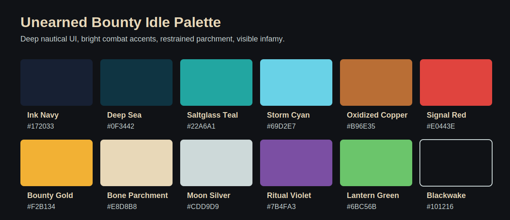
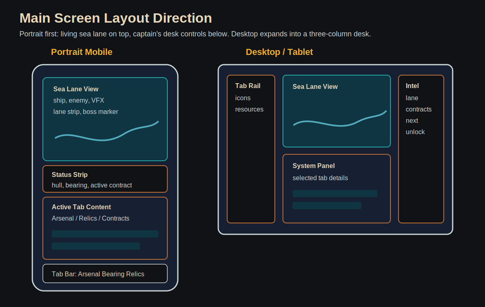

# Visual Design Bible: Unearned Bounty Idle

Research date: 2026-05-21

Note on naming: the user referred to creative director "Ricard Pince." Public reference pages found during this pass consistently use "Richard Pince." This document uses "Richard Pince" when citing public sources, while preserving the user's creative direction intent.

## Purpose

This bible translates the visual DNA of Unearned Bounty into a mobile-friendly idle game direction. The target is not a literal remake of the old multiplayer arena look. It is the same world seen through a different lens: less constant steering, more captain's desk, more long-term voyage, more readable progression.

The game should feel like:

- A playable concept-art diorama of a mythic pirate sea.
- A working captain's desk layered over a living ocean lane.
- An arcade pirate fantasy with enough operational clarity for idle-game numbers.
- A mobile UI that still feels authored, handcrafted, and strange.

## Source Anchors

These are the strongest public source anchors for the visual direction:

- Richard Pince's ArtStation page for `Unearned bounty_Pirate Port` identifies the piece as a concept for the main pirate hideout and describes its blend as "one part cartoon, one part real, and one part Disneyland attraction." It also mentions exploratory sketches and the game's shape language. Source: https://richardpince.artstation.com/projects/goExK
- Richard Pince's ArtStation page for `Unearned bounty _ Pirate Ship Designs Lineup` says the main challenge was establishing a pushed cartoony style, with whimsical shape language while preserving structural feel. It also notes the ships and architecture needed shapes and surfaces that could realistically be achieved in 3D. Source: https://richardpince.artstation.com/projects/B9EA9
- Richard Pince's ArtStation page for `Unearned Bounty Pirate Emotes` explains that early detailed portrait/emote attempts became unreadable at small size, so the final icons were simplified. It also notes the captain concept needed to feel more pirate and "all in" than an earlier version. Source: https://richardpince.artstation.com/projects/od2bm
- Public ArtStation search text for `Unearned Bounty Icon Concepts` describes ability icons for pirate ships, including poison gas, dragon fire, icon states, and ramming speed. Source: https://richardpince.artstation.com/projects/x20kR
- The Steam page frames Unearned Bounty as a stylized, action-heavy naval combat game about becoming the most infamous pirate, with ship abilities, infamy, a golden-skull target, and a wrapping map. Source: https://store.steampowered.com/app/377260/Unearned_Bounty/
- IndieDB hosts ship concept art for Unearned Bounty and describes battles against pirate hunters, trade ships, and other players. Source: https://www.indiedb.com/games/unearned-bounty/images/ship-concept-art
- GDWC describes the original game as stylized arcade broadside naval warfare with a light touch of fantasy, nodding to Twisted Metal, Halo, and League of Legends. Source: https://thegdwc.com/pages/game.php?game_guid=2e85e4ed-24b4-44cd-a888-2641bbed484a
- Retro Gamesmaster's Unearned Bounty interview page embeds Richard Pince ship lineup, sketches, NPC ship, and Ghastly Crow reference images. Source: https://www.retrogamesmaster.co.uk/unearned-bounty/

Do not copy exact concept art, ship designs, icons, or compositions from these sources into new production assets unless the project already owns and clears those assets. Use them to extract principles: shape language, color energy, icon readability, and fantasy tone.

## Visual North Star

The new game is `a toy-theater sea adventure viewed from a captain's desk`.

The phrase matters:

- `Toy-theater` keeps the old stylized charm: chunky ships, readable silhouettes, theatrical staging, exaggerated effects.
- `Sea adventure` keeps the horizon alive: lanes, storms, ports, bounties, relics, and strange waters.
- `Captain's desk` makes it idle-native: charts, ledgers, relic trays, bounty notices, and compact controls surround the action.

The old game was about steering through chaos. This game is about commanding a voyage that continues without you.

## Core Pillars

### 1. Pushed Cartoon, Real Structure, Attraction

Richard Pince's own description of Pirate Port gives the broad target: cartoon, real, and attraction. The ship lineup page tightens that into a production rule: pushed cartoony style, whimsical shape language, and structural feel that can still become real 3D forms. Translate it this way:

- Cartoon: forms are exaggerated, readable, and expressive from a small screen.
- Real structure: objects have believable material logic, rigging, surfaces, construction, and weight.
- Attraction: every location feels staged, inviting, and a little larger than life, like you could ride through it.

This is not gritty historical piracy. It is not flat Saturday-morning cartoon either. It is built, painted, and theatrical.

### 2. Silhouette First

Every ship, relic, faction mark, button icon, and boss should be identifiable as a black shape at mobile size.

Rules:

- Ships need one dominant silhouette hook: split prow, leaning mast, stacked cabins, lantern spine, crown-shaped bow, sawtooth sails.
- Relics need one dominant metaphor: tooth, coin, eye, nail, thread, bone, compass.
- Enemies need family-readable hull shapes before color does any work.
- UI icons must read at 24 px and feel good at 64 px.
- Character portraits and emotes must read as emotion plus role before costume detail.

### 3. Mystic, But Operational

Magic should feel like something a crew can use, chart, bottle, slot, commission, or burn. Avoid vague glow as the only signal.

Good mystical visuals:

- Stormglass lenses that bend the horizon.
- Relic sockets that click into a compass.
- Wards drawn as salt circles and lantern arcs around the hull.
- Infamy marks stamped like hot wax on a bounty notice.
- Bearing flags physically changing on the mast.

Weak mystical visuals:

- Generic purple haze.
- Random runes with no mechanical meaning.
- Effects that obscure combat state.

### 4. Bright Combat, Quiet Controls

The open-sea combat window should carry the color and motion. The surrounding UI should be calmer, darker, and more legible.

This creates a useful mobile hierarchy:

- The ocean and combat tell the player something is alive.
- The captain's desk tells the player what can be decided.
- Rewards and alerts flash briefly, then settle into the ledger.

### 5. Infamy Has A Look

Unearned Bounty's identity depends on infamy. It should be a visual system, not only a number.

Infamy motifs:

- A gold skull or skull-adjacent trophy mark as a legacy nod, redesigned to avoid copying exact old UI.
- Red wax, black ink, stamped notices, torn contract edges.
- Wanted flags appearing on enemy nameplates.
- Increasingly ornate bounty seals as the player climbs tiers.
- "The player is the bounty" represented by the player's own ship appearing on notices.

## Palette

Use a broad palette, not a one-note brown pirate UI and not an all-blue naval UI. The primary experience should mix deep sea values, oxidized metal, signal colors, and strange magical accents.

| Role | Name | Hex | Use |
| --- | --- | --- | --- |
| Primary dark | Ink Navy | `#172033` | UI background, night sea, deep panels |
| Secondary dark | Blackwake | `#101216` | deepest shadows, modal scrims, outlines |
| Ocean body | Deep Sea | `#0F3442` | combat water, panel fills |
| Ocean accent | Saltglass Teal | `#22A6A1` | lane progress, navigation, charts |
| Storm accent | Storm Cyan | `#69D2E7` | speed, maelstrom, ward edge highlights |
| Warm material | Oxidized Copper | `#B96E35` | frames, rivets, tab accents |
| Action danger | Signal Red | `#E0443E` | damage, warnings, wanted marks |
| Reward | Bounty Gold | `#F2B134` | doubloons, infamy seals, boss rewards |
| Text surface | Bone Parchment | `#E8D8B8` | map scraps, contract notices, callouts |
| Neutral light | Moon Silver | `#CDD9D9` | body text on dark, inactive icons |
| Occult | Ritual Violet | `#7B4FA3` | curses, relic links, ward enemies |
| Recovery | Lantern Green | `#6BC56B` | repairs, valid states, success |

### Resource Color Coding

| Resource | Color | Rationale |
| --- | --- | --- |
| Salvage | Oxidized Copper | metal, scrap, repairs |
| Doubloons | Bounty Gold | money and prize value |
| Craft Materials | Bone Parchment plus Copper | artisan supplies |
| Relic Fragments | Ritual Violet | strange, slot-based, magical |
| Charts | Saltglass Teal | navigation and route knowledge |
| Infamy | Signal Red plus Bounty Gold | danger plus reward |

Accessibility rule: color never carries meaning alone. Pair resource color with icon shape and label.

## Shape Language

### Ships

Ships should be chunky, expressive, and slightly improbable. The old Unearned Bounty ship lineup direction explicitly aimed for pushed cartoon style, whimsical shape language, and credible 3D-achievable construction. Preserve that triangle.

Production rules:

- Use large hull masses, simplified decks, oversized figureheads, and sails that create strong negative shapes.
- Push each ship class toward one readable personality.
- Let mast angles, sail tears, prow shapes, and cabin stacks define identity.
- Keep cannon silhouettes oversized enough to read during auto-combat.
- Use asymmetry for pirate ships, symmetry for Crown Navy authority, broken rhythm for cursed enemies.
- Every exaggerated element still needs a plausible support: a mast can bend, but it should attach cleanly; a dragon prow can be huge, but it should share mass with the hull; a spike can be ridiculous, but it should read as bolted, carved, grown, or cursed.

Legacy ship-name reference:

- `The Spitting Dragon`, `The Ghastly Crow`, `Iron Horns`, and `The Bayonet` are useful because each name implies a silhouette before a stat block. New ship and enemy designs should follow that pattern: a name should tell the artist what shape to push.

MVP ship categories:

| Category | Visual read | Notes |
| --- | --- | --- |
| Player starter | patched but proud, high stern, broad sail | should look upgradeable, not pathetic |
| Long Nine Cannons build | longer gun deck, broadside ports emphasized | readable DPS identity |
| Harpoon build | forward tusk/prow rig, cable drums | anti-armor identity |
| Firepot build | chimney pots, red lanterns, scorched sail edges | damage-over-time identity |
| Shrine Lantern build | hanging lantern spine, salt rings, bright ward line | occult/ward identity |

### Enemy Families

| Family | Silhouette | Color accent | Visual behavior |
| --- | --- | --- | --- |
| Privateers | trim, fast, triangular sails | red and off-white | clean broadside duels |
| Ironclads | low, armored, heavy prow | dark iron and copper | sparks, ricochets, slow turns |
| Hexed Corsairs | thin masts, torn sail shapes, lantern clusters | violet and cyan | ward shimmer, ghost trails |
| Reef Beasts | irregular hull-breaker silhouettes and coral growth | teal and bone | lunging entries, debris splash |
| Crown Navy | high discipline, straight lines, flags, ordered decks | white, gold, red | formation markers and official seals |
| Drowned Fleet | collapsed rigging, sunken hull shapes, bell or chain motifs | black, green, violet | slow rise, water sheets, ward pulses |

### Relics

Relics are tabletop objects first, magic items second. They should feel like things you physically slot into the compass.

Rules:

- Icon has a strong outer silhouette and a bright inner focal point.
- Slot color is shown as a rim, not by recoloring the whole relic.
- Resonance is a physical fill, crack repair, ember line, or engraved ring, not just a progress bar.
- Constellation links look like taut glowing strings or etched navigation lines.

### Characters and Emotes

The old emote exploration is directly relevant to a mobile idle game because portraits, contract targets, crew faces, and notification icons will often be tiny. The lesson is simple: detail is the enemy until the read is proven.

Rules:

- Start every character icon as a bold head-and-shoulders silhouette with one emotional pose.
- Readability target: the player should understand the expression at 32 px before seeing costume details at 128 px.
- Push "pirate commitment" hard: hat, hair mass, beard shape, scar, teeth, jewelry, coat collar, or cursed feature should create a clear identity.
- Avoid generic sailor faces. The captain, bounty hunters, artisans, faction brokers, and crew should each feel like they chose this life dramatically.
- For UI emotes, use fewer shapes, stronger eyebrows/eyes/mouth, and bigger color blocks than a full illustration would use.
- Do not render tiny buckles, stitching, or facial texture unless the icon has already passed the small-size test.

Character-use cases:

| Use | Visual role |
| --- | --- |
| Player captain portrait | identity anchor for Infamy and prestige |
| Bounty hunter portraits | contract target clarity and escalating threat |
| Faction brokers | source of contract tone |
| Artisan's Hold portrait | makes Artificing feel commissioned by a person |
| Crew role portraits | post-MVP personality and long-term attachment |
| Combat emotes | short, readable feedback for victory, danger, blocked systems |

### UI Panels

UI should feel like an assembled captain's workspace:

- Dark desk base.
- Inset chart panels.
- Brass/copper clips and tabs.
- Torn contract notices only where text benefits from being a notice.
- Compass rings and ledger rows for systems.

Avoid:

- Nested cards.
- Heavy parchment everywhere.
- Decorative ropes around every rectangle.
- Tiny pirate clip-art flourishes.
- Wooden planks as a full-screen background.

## Camera and Main Screen

The recommended combat camera is a 2.5D side/three-quarter sea lane:

- Player ship anchored left or lower-left.
- Enemy ships approach from right or upper-right.
- Lane progress runs behind or below as a horizon strip.
- Boss and Stormwall markers appear on the lane strip before they arrive.
- The ship should never be visually covered by upgrade panels during combat.

Why this camera:

- Easier mobile readability than a free arena.
- Preserves broadside identity.
- Lets ship silhouettes stay recognizable.
- Gives room for combat numbers without burying the scene.

Alternative desktop mode can widen the scene, but the portrait composition should be designed first.

## Mobile UI Layout

See the rough wireframe:

### Portrait Layout

Top 35-40%: living sea lane.

Middle strip: ship status, current bearing, boss/Stormwall progress, active contract.

Bottom 45-50%: tab content. Default tab is Arsenal early, later Logbook or Contracts depending on alerts.

Persistent bottom nav: icon tabs for Arsenal, Bearing, Artificing, Relics, Cartography, Contracts, Logbook. Locked future tabs are visible as dim silhouettes once discovered.

Resource strip: compact, always visible, with current amount and rate for the most relevant 3-5 resources. Additional resources collapse into a drawer.

### Desktop Layout

Left: tab rail and resources.

Center: sea lane and current system view.

Right: lane intel, active contracts, next unlock, missing-multiplier diagnostics.

This preserves the "captain's desk" concept without making mobile users manage desktop density.

## Interaction Rules

### Touch Targets

- Minimum touch target: 44 x 44 px.
- Preferred primary action height: 48-56 px.
- Avoid placing small buttons at extreme top corners on phone.
- Do not require hover for core explanations. Long-press and tap-to-pin tooltips are required on mobile.

### Tab States

Each tab icon has states:

- Locked unknown: silhouette only, no name.
- Locked known: icon plus unlock hint.
- Available: full icon, dim if no action.
- Attention: small signal-color pin, not a full flashing button.
- Critical: red-gold seal for contracts, boss warnings, blocked systems.

### Button Visual States

For active abilities and upgrades, use four states:

- Locked: dark, desaturated, visible requirement.
- Affordable: warm rim, subtle pulse.
- Active/running: filled accent, motion line or timer.
- Completed/mastered: stamped mark or check seal.

## Iconography

The old ability icon concept direction is highly useful because idle games need many tiny system icons. Preserve the idea of bold special-ability silhouettes, but make the icon set more systematic.

Icon rules:

- One idea per icon.
- Large foreground shape, minimal background texture.
- 2 px minimum interior gap at 32 px.
- Use rim color for category and inner highlight for state.
- Build icons at 128 px master size, export 64, 32, 24, and 16.
- Test every icon at 24 px on dark and parchment backgrounds.

Icon families:

| Family | Shape base | Examples |
| --- | --- | --- |
| Arsenal | metal silhouettes | cannon, harpoon, firepot, lantern |
| Bearing | flags and compass marks | hunter flag, iron flag, scout arrow, salvage hook |
| Artificing | tools and materials | gear, timber, lens, sigil cloth |
| Relics | object silhouettes | tooth, coin, eye, nail, thread, bone |
| Cartography | map marks | route, storm line, compass point, ink pin |
| Contracts | notices and seals | wanted mark, faction seal, bounty target |
| Automation | ledger marks | quill, gear, checkmark, clock |

## Typography

The UI needs legibility first. Pirate typefaces are garnish, not body text.

Recommended direction:

- Body/UI: a clean humanist sans with strong numerals. Good choices if available: Atkinson Hyperlegible, Inter, Barlow, Source Sans 3.
- Display/logo: a custom or decorative serif/slab only for title treatments, bounty headers, and rare splash moments.
- Numbers: use tabular numerals for resource strips and rates.

Mobile sizes:

| Use | Minimum | Preferred |
| --- | --- | --- |
| Resource amount | 13 px | 15-16 px |
| Body text | 14 px | 16 px |
| Button text | 14 px | 16 px |
| Section title | 16 px | 18-20 px |
| Combat floating numbers | 12 px | 14-18 px by importance |

Avoid distressed fonts for live UI labels. If a label must be decorative, pair it with a plain subtitle.

## Materials and Rendering

### Ships and World

Preferred rendering direction:

- Stylized 3D or 2D-painted assets with chunky forms.
- Hand-painted gradients and selective rim highlights.
- Not photorealistic, not pixel art, not flat vector-only.
- Low-to-medium detail density so assets survive mobile scale.

Material reads:

- Wood: broad planes with painted edge wear.
- Metal: copper and dark iron with simple highlight bands.
- Cloth: large color blocks, visible tears, emblem shapes.
- Water: stylized waves, color bands, foam ribbons.
- Magic: color-coded glows with hard silhouettes and controlled particles.

### UI Materials

Use material hints sparingly:

- Copper tabs and rivets for affordances.
- Ink-blue panels for dense numeric areas.
- Parchment only for contracts, maps, and one-off event text.
- Wax seals for completion and infamy.
- Glass/lens rings for relic and compass views.

## Motion Bible

Idle games need motion that reassures without exhausting.

Constant low motion:

- Water drift.
- Ship bob.
- Sail flutter.
- Compass needle tremble.
- Lane progress tick.

Event motion:

- Cannon recoil and smoke pop.
- Harpoon cable snap.
- Firepot splash burst.
- Ward shatter as a ring crack.
- Relic slot click and constellation line draw.
- Contract completion stamp.
- Return to Port transition: ship silhouette enters harbor, ledger flips to prestige preview.

Avoid:

- Full-screen particle storms during normal farming.
- Combat numbers that obscure enemy silhouettes.
- UI elements that pulse forever.
- Motion that changes layout size.

## Screen Treatments

### Sea Lane

Mood: open water, visible progress, arcade combat clarity.

Must show:

- Player ship silhouette.
- Current enemy family.
- Damage/defense signals.
- Lane progress.
- Boss marker.
- Active contract hint.
- Stormwall marker when relevant.

### Arsenal

Mood: drydock ledger.

Visuals:

- Weapon cards as horizontal rows with a small ship diagram or weapon icon.
- Milestones shown as pips on a cannon/rigging line.
- Counter tags: strong vs armor, shreds ward, burns regeneration.

### Ship's Bearing

Mood: command flags and compass direction.

Visuals:

- Four large flag buttons.
- Current bearing mast flag shown in combat viewport.
- Momentum represented as a tide line or wind fill.
- Switching bearing should feel like ordering the crew, not toggling a spreadsheet.

### Artificing

Mood: artisan's hold.

Visuals:

- Workbench strip with tools and current commission.
- Recipes as commissioned jobs, not generic crafting tiles.
- Mastery as etched marks on the recipe plate.
- Completion as the artisan's stamp.

### Relic Compass

Mood: occult navigation tray.

Visuals:

- Physical circular or semi-circular compass board.
- Sockets with color rims.
- Relics as chunky drag/click objects.
- Ghosted constellation lines before discovery.
- Discovered links drawn like luminous chart lines.

### Cartography

Mood: map study.

Visuals:

- Simple node path on a sea chart.
- Lanes as routes, not abstract nodes.
- Completed research stamped or inked in.
- One active branch in MVP; other branches ghosted after first prestige.

### Contracts

Mood: wanted board.

Visuals:

- Contract notices pinned to a dark board or ledger spread.
- Faction seal, target silhouette, objective, reward.
- Expiry shown as a tide-clock or wax seal crack.
- Completion uses a loud stamp moment.

### Return to Port

Mood: relief, accounting, temptation.

Visuals:

- Harbor silhouette in the background.
- Left list: what resets.
- Right list: what persists.
- Center: Infamy Marks gained and affordable unlocks.
- Do not make this a scary deletion screen. It should feel like coming home with stories.

## Environment Bible

### Pirate Port

Richard Pince's Pirate Port is the strongest old concept anchor. The new version should keep the "attraction" quality: layered rooftops, docks, signs, oversized silhouettes, and a route through the composition.

For the idle game:

- Pirate Port is the prestige hub.
- It appears behind Return to Port and contract screens.
- It should feel busy but not visually noisy.
- Buildings can map to systems: drydock, artisan hold, wanted board, relic shrine, chart room.

### Sea Regions

| Region | Palette | Visual hook |
| --- | --- | --- |
| Saltglass Expanse | teal, gold, navy | bright open water and glassy wave lines |
| Widow's Meridian | violet, silver, black | thin moon, strange horizon, ward enemies |
| Bell Reef | bone, green, teal | reef arches, bells, relic fragments |
| Crownless Channel | red, white, gold | official markers torn down, navy patrols |
| Blackwake Gyre | black, cyan, violet | circular currents, storm lights |

### Stormwall

The Stormwall is a progression wall made visible.

Visual rules:

- It appears on the lane progress strip before the player hits it.
- It has readable layers: wind, wave, ward, enemy flag, or boss marker.
- When the player stalls, the Stormwall diagnostic explains why: armor, ward, damage, speed, or resource focus.

## Faction Visuals

| Faction | Shape language | Palette | UI seal |
| --- | --- | --- | --- |
| Freebooters Guild | patched flags, angled marks, practical gear | copper, red, navy | crossed tools and cutlass-like mark |
| Shattered Crown | straight banners, broken crown geometry | white, red, gold | cracked crown seal |
| Drowned Courts | rings, bells, long vertical shapes | violet, green, silver | bell over dark wave |
| Independent Merchants | ledgers, cargo marks, rope knots | gold, teal, parchment | coin and knot |

Faction designs should be readable in contract notices and enemy nameplates before they become full characters.

## Mobile Production Constraints

### Performance

- Prefer texture atlases for ships, UI, icons, VFX.
- Cap constant particles. Use animated sprite sheets for common effects.
- Keep combat viewport effects layered and recyclable.
- Do not make the background a high-cost full-screen shader if a layered animated texture works.

### Readability

- Test every screen at 360 x 800 and 390 x 844.
- Test with resource values 10x longer than expected.
- Test icons at 24 px.
- Test dark sunlight glare mode: UI must be playable at low contrast.
- Use scalable layouts; never rely on tiny hover-only details.

### Asset Resolution Seed

| Asset | Master size | Notes |
| --- | --- | --- |
| Ability/resource icon | 128 x 128 | export down to 64/32/24/16 |
| Relic icon | 256 x 256 | needs more texture than resource icons |
| Ship side sprite | 512-1024 wide | depends on combat camera |
| Enemy small ship | 384-768 wide | family read is more important than detail |
| Contract notice | scalable 9-slice | text rendered by UI, not baked |
| UI panel | scalable 9-slice | dark base with minimal material edge |
| Combat background layer | 1920 wide or tiled | parallax, avoid unique huge images per lane |

## Art Brief Templates

Use these for future artists or image-generation references. Do not prompt "in the style of Richard Pince." Prompt the extracted principles instead.

### Ship Lineup Brief

Create a stylized pirate ship lineup for a mobile idle naval game. Each ship has a chunky readable silhouette, pushed cartoony proportions, whimsical shape language, and construction that still feels achievable as a 3D game asset. Use broad painted forms, arcade-fantasy naval details, and one unique gameplay identity per ship. Blend cartoon clarity, real structural logic, and theme-park-attraction charm. Show the starter ship, harpoon build, firepot build, shrine lantern build, and armored enemy ship on a neutral background.

### Pirate Port Brief

Create a pirate hideout port for a mystical age-of-exploration idle game. The scene should feel like a layered attraction diorama: crooked docks, readable building silhouettes, a drydock, an artisan's hold, a wanted board, a relic shrine, and a chart room. Use deep navy shadows, teal water, copper accents, signal red flags, bounty gold lights, and a touch of occult violet. Keep the composition readable for a mobile prestige hub background.

### Mobile Main Screen Brief

Design a portrait mobile UI for a pirate idle game. Top area shows a stylized side-view sea lane with the player's ship fighting an enemy ship. Middle area shows ship hull, bearing flag, lane progress, boss marker, and active contract. Bottom area shows a dense but readable captain's desk UI with tabs for Arsenal, Bearing, Artificing, Relics, Cartography, Contracts, and Logbook. Dark nautical panels, copper accents, teal navigation highlights, and clear 44 px touch targets.

### Relic Compass Brief

Design a physical relic compass UI board for a mystical pirate idle game. It has colored sockets, chunky relic objects, glowing constellation lines, engraved chart marks, and a dark captain's desk surface. Relics include a tooth, coin, eye, nail, thread, and bone. It must read clearly on mobile and support drag or tap interactions.

### Ability Icon Brief

Create a 128 px game ability icon with one bold foreground silhouette, strong category rim color, minimal background texture, and clear active/locked/ready states. It should be readable at 24 px. Theme options: harpoon drag, firepot burst, shrine ward, ramming speed, poison gas, stormglass lens.

### Character Emote Brief

Create a set of small pirate character emotes for a mobile idle game. Each emote must read clearly at 32 px, using simplified head-and-shoulder silhouettes, exaggerated expressions, strong pirate identity, and minimal costume detail. Include captain confidence, contract completed, danger spotted, system blocked, bounty hunter taunt, and artisan success. Prioritize emotion and role over rendered detail.

## Do And Do Not

### Do

- Preserve the playful arcade confidence of old Unearned Bounty.
- Keep ship and icon silhouettes bold.
- Use the captain's desk as the UI metaphor.
- Make infamy visible through stamps, seals, wanted marks, and target flags.
- Let combat be colorful and the UI be calm.
- Build mobile readability into every asset from the start.
- Treat relics and contracts as physical objects in the player's workspace.
- Simplify portraits and emotes until their emotion reads at tiny size.

### Do Not

- Do not turn the game into sepia parchment.
- Do not pursue historical realism at the cost of shape clarity.
- Do not copy One Piece visual signatures, character concepts, powers, or faction language.
- Do not copy Richard Pince's specific compositions or old ship designs unless ownership is confirmed.
- Do not make every magical element purple.
- Do not hide required information in tiny decorative UI.
- Do not let resource numbers visually compete with the combat window.
- Do not mistake costume detail for character identity.

## First Visual Production Pass

Recommended first asset list before implementation polish:

1. One portrait main-screen mockup.
2. One open-sea combat background for Saltglass Expanse.
3. Player starter ship side-view sprite or paintover.
4. Four weapon identity overlays: cannon, harpoon, firepot, shrine lantern.
5. Four enemy family silhouettes.
6. Six relic icons and one Relic Compass board.
7. Ten resource/system icons.
8. One contract notice template and four faction seals.
9. One Return to Port harbor backdrop.
10. One UI kit page: panels, tabs, buttons, alerts, tooltips, progress strips.
11. Six character/emote icons: captain, artisan, bounty hunter, faction broker, danger, contract complete.

## Visual QA Checklist

Before accepting a screen or asset:

- Does it read at mobile size?
- Can the player tell what changed after an upgrade?
- Is the interactable element obvious?
- Does color meaning also have an icon or label?
- Is the pirate fantasy present without burying the data?
- Does the asset feel like cartoon plus real plus attraction?
- Does the screen still work in grayscale?
- Are long numbers and labels safe?
- Is the player being invited to command, not merely decorate?
- Could the shape plausibly be built as a low-to-mid complexity 3D asset?
- For portraits/emotes, does the emotion read at 32 px?

## Source Table

| Topic | Source |
| --- | --- |
| Richard Pince Pirate Port concept and art-direction note | https://richardpince.artstation.com/projects/goExK |
| Richard Pince pirate ship design lineup and shape-language note | https://richardpince.artstation.com/projects/B9EA9 |
| Richard Pince pirate emotes and small-size simplification note | https://richardpince.artstation.com/projects/od2bm |
| Richard Pince icon concepts page | https://richardpince.artstation.com/projects/x20kR |
| Unearned Bounty Steam page, tags, infamy, ship abilities, wrapping map | https://store.steampowered.com/app/377260/Unearned_Bounty/ |
| Unearned Bounty ship concept art page | https://www.indiedb.com/games/unearned-bounty/images/ship-concept-art |
| GDWC description: stylized arcade broadside naval combat with light fantasy | https://thegdwc.com/pages/game.php?game_guid=2e85e4ed-24b4-44cd-a888-2641bbed484a |
| Retro Gamesmaster interview and embedded Richard Pince images | https://www.retrogamesmaster.co.uk/unearned-bounty/ |
